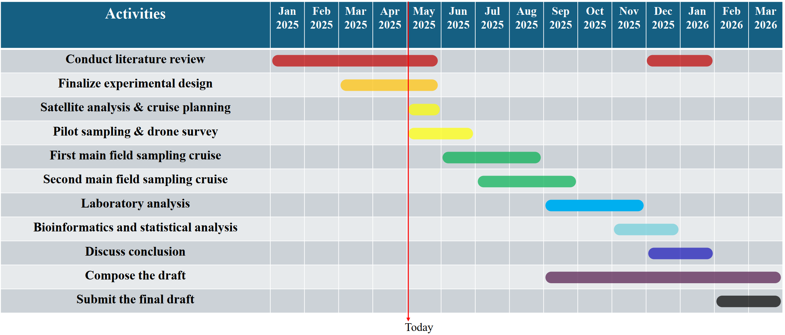

## Research Question:
What is the composition of bacterial communities in the sea surface microlayer (SML) of frontal slicks in the Southeastern Mediterranean Sea (SE-Med), and how does it differ from those in the underlying water and adjacent non-slick areas?

## A testable hypothesis using ABT:
Bacterial communities in marine environments are known to be influenced by SML conditions and localized hydrodynamic features such as slicks, and previous studies suggest distinct microbial assemblages in these slicks compared to open water. But the specific bacterial composition in the SML of frontal slicks in the SE-Med, and how it differs from underlying water and adjacent non-slick areas, is currently unknown. Therefore, we hypothesize that the bacterial community composition in the SML of frontal slicks will show significant differences in diversity, abundance, and specific functional taxa compared to the communities in underlying water and adjacent non-slick areas due to unique physicochemical gradients and nutrient enrichment associated with slick formation and persistence.

## Research Goal: 
Investigate the bacterial community composition in the SML of frontal slicks in the SE-Med, compared to underlying water and adjacent non-slick areas.

## Specific:	
Conduct field-based sampling campaigns to systematically collect SML samples and corresponding underlying water samples from both frontal slick and adjacent non-slick areas within Nile River plume of the SE-Med.
Characterize the bacterial community structure, including taxonomic diversity and relative abundance, using DNA sequencing and Flow-cytometry techniques.

## Measurable:
1.	Quantify (16s rRNA) the bacterial community composition using established diversity indices (e.g. Shannon-Wiener Index, Simpson’s Index). 
2.	Measure bacterial cell abundances and size distributions precisely with flow cytometry.
3.	Perform statistical significance testing on the above-mentioned datasets between 1) SML and underlying water within frontal slick. 2) SML in the frontal slick and adjacent non-slick area.

## Achievable:
1.	Collaborate with Israel Oceanographic and Limnological Research (IOLR) to obtain access to research vessels, equipment, and expertise needed for DNA sequencing and flow cytometry analysis.
2.	Analyse the Copernicus satellite images and wind speed to determine the date for one cruise.
3.	Conduct drone surveys on the cruise to identify the frontal slicks.

##Relevant:
Enhance scientific understanding of microbial community dynamics associated with frontal slicks and elucidate how these dynamics are modulated by physical oceanographic factors, particularly surface convergence processes (usually happen in frontal zone). 
Contribute to a broader understanding of surface water ecosystem in the oligotrophic ocean.

## Time-bound:
Finalize experimental designs, complete pilot and main sampling campaigns, and analyse microbial communities using DNA sequencing and flow cytometry within 8 months.
Submit a comprehensive peer-reviewed manuscript highlighting insights on bacterial community composition and abundance in frontal slicks and associated ecosystems of the SE-Med within 14 months.

## Experimental design questions:
### 1.	Research types:
This research will be quantitative, involving the collection of original primary data. The research design is primarily descriptive and correlational, aiming to describe bacterial communities and identify significant differences in bacterial composition 
among SML vs underlying water, and slick vs non-slick area.
### 2.	Sources:
The study will focus specifically on bacterial communities from SML and underlying waters associated with frontal slicks and adjacent non-slick areas. Samples will be collected using targeted sampling based on satellite-derived chlorophyll front detection
and drone-based field observation. Field data collection will take place during planned research cruises in the offshore Ashdod, SE-Med, scheduled in summer months (June-September) when slicks are more prevalent.
### 3.	Research methods:
SML sample will be collected using the classic glass plate methods, and underlying water (0.5 m depth) will be collected using acid-cleaned polyethylene bottles. Analysis will involve high-throughput DNA sequencing (16S rRNA gene amplicons) for taxonomic 
composition and flow cytometry for quantifying bacterial abundance.
### 4.	Practicalities:
Field sampling will be carried out in one cruise in summer of 2025. The data collection (including lab analysis in IOLR) will be completed in 8 months. 
Potential obstacles include: 1) To mitigate weather-related constraints, alternative sampling dates and backup study sites will be pre-identified based on real-time satellite imagery and forecasted wind conditions. 2) The short-lived nature of frontal 
slicks may occasionally prevent the completion of full sampling protocols. In such cases, the number of biological replicates per location type may be reduced from three to two to ensure spatial coverage.

Field sampling will include at least three independent replicate samples per location type (slick SML, underlying slick water, non-slick SML, and non-slick underlying water). Additionally, technical replicates will be included during DNA extraction 
and flow cytometry runs to assess reproducibility and analytical precision. Overall, each cruise will aim to sample at least 1-2 frontal zones, resulting in a total of 36-72 subsamples.

