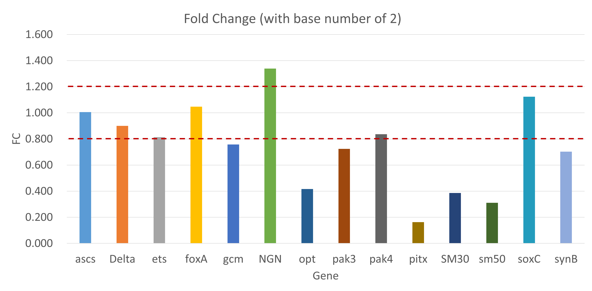

# Overview
**Reserve transcription combined with the polyerase chain reaction (PCR) has been widely used as a powerful tool to quantify gene expression.**
**Quantitative PCR (qPCR), which is also called real-time PCR, is a variant of the polymerase-chain-reaction in which the accumulation of amplified DNA is monitored during each cycle with a fluorescent signal.**

Firstly, the RNA should be isolated and reverse-transcribed into complementary DNA (cDNA), which will serve as the amplification template. Secondly, the template will run through three phases of qPCR, which is Denaturation, Annealing and Elongation.

# Methodology

**The ΔΔCt method is a method of qPCR to estimate the relative expression change batween a target gene and a calibrator gene (control).** *（livak and Schmittgen, 2001）* 
**Cycle threshold (Ct) represents the cycle at which fluorescence surpasses a set threshold.**

Equations for ΔΔCt method are listed as following:

ΔCt  = Cttarget - Ctreference

ΔΔCt = Ctexperimental - Ctcontrol

Fold Change (FC) = 2-ΔΔCt

If the FC > 1, the target gene is interpreted as up-regulation. 
If the FC < 1, the target gene is interpreted as down-regulation.

# Results and analysis

**Table 1.** Relative gene expression calculated by the ΔΔCt method (qPCR).

|           Cycle Threshold (Ct)          |         |             |        |        |         |        |         |        |        |        |        |        |        |         |        |
|:---------------------------------------:|:-------:|:-----------:|:------:|:------:|:-------:|:------:|:-------:|:------:|:------:|:------:|:------:|:------:|:------:|:-------:|:------:|
|                                         | Tubulin |     ascs    |  Delta |   ets  |   foxA  |   gcm  |   NGN   |   opt  |  pak3  |  pak4  |  pitx  |  SM30  |  sm50  |   soxC  |  synB  |
|               DMSO Control              |  23.30  |    29.09    |  25.96 |  24.72 |  24.37  |  28.35 |  28.35  |  31.02 |  25.41 |  25.57 |  29.68 |  20.97 |  23.70 |  25.07  |  24.13 |
|          Inhibtior treartment           |  22.72  |    28.51    |  25.54 |  24.44 |  23.72  |  28.18 |  27.35  |  31.71 |  25.29 |  25.25 |  31.72 |  21.77 |  24.81 |  24.33  |  24.06 |
|                                         |         |             |        |        |         |        |         |        |        |        |        |        |        |         |        |
|                                         |         |     Δ𝐶𝑡     |        |        |         |        |         |        |        |        |        |        |        |         |        |
|                   Δ𝐶𝑡                   |         |     ascs    |  Delta |   ets  |   foxA  |   gcm  |   NGN   |   opt  |  pak3  |  pak4  |  pitx  |  SM30  |  sm50  |   soxC  |  synB  |
|               DMSO Control              |         |     5.80    |  2.67  |  1.42  |   1.07  |  5.06  |   5.06  |  7.72  |  2.11  |  2.28  |  6.38  |  -2.33 |  0.40  |   1.78  |  0.83  |
|          Inhibtior treartment           |         |     5.79    |  2.82  |  1.72  |   1.00  |  5.46  |   4.63  |  8.99  |  2.58  |  2.53  |  9.01  |  -0.95 |  2.09  |   1.61  |  1.34  |
|                                         |         |             |        |        |         |        |         |        |        |        |        |        |        |         |        |
|                                         |         |     ΔΔ𝐶𝑡    |        |        |         |        |         |        |        |        |        |        |        |         |        |
|                                         |         |     ascs    |  Delta |   ets  |   foxA  |   gcm  |   NGN   |   opt  |  pak3  |  pak4  |  pitx  |  SM30  |  sm50  |   soxC  |  synB  |
|                   ΔΔ𝐶𝑡                  |         |   -0.009    | 0.151  | 0.297  | -0.067  | 0.401  | -0.421  | 1.265  | 0.466  | 0.258  | 2.623  | 1.374  | 1.687  | -0.167  | 0.510  |
|                                         |         |             |        |        |         |        |         |        |        |        |        |        |        |         |        |
|                                         |         | Fold Change |        |        |         |        |         |        |        |        |        |        |        |         |        |
|                                         |         |     ascs    |  Delta |   ets  |   foxA  |   gcm  |   NGN   |   opt  |  pak3  |  pak4  |  pitx  |  SM30  |  sm50  |   soxC  |  synB  |
| Fold Change   (with base number of 2)   |         |    1.006    | 0.901  | 0.814  |  1.047  | 0.757  |  1.339  | 0.416  | 0.724  | 0.836  | 0.162  | 0.386  | 0.310  |  1.123  | 0.702  |
| Fold Change   (with base number of 1.9) |         |    1.005    | 0.908  | 0.826  |  1.044  | 0.773  |  1.311  | 0.444  | 0.742  | 0.847  | 0.186  | 0.414  | 0.339  |  1.113  | 0.721  |

*Since the efficiency of PCR runs differs in different instrument and lab, I presented here two cases of the 100% efficiency (with base number of 2), and ≈90% efficiency (with base number of 1.9 generally used in Smadar's lab).*

**Figure 1.** qPCR bar plot of relative gene expression.

# Discussion
1) The reference gene, *Tubulin* Ct decreased from 23.30 (control) to 22.72 (treatment) after trreatment, which marks around 1.5 fold drift.
2) The inhibitor produced gene-specific effects. Four loci (with base number of 2), which were ***opt (0.42-fold)***, ***pitx (0.16-fold)***,  ***SM30 (0.39-fold)*** and ***sm50 (0.31-fold)***, were strongly repressed. A second tier ( ***gcm, pak3 and synB***) showed moderate down-regulation, whereas ***ascs, Delta, ets, foxA, pak4 and soxC*** remained essentially unchanged (0.8–1.2 fold). Only one gene, ***NGN***, exhibited appreciable up-regulation, rising to 1.34-fold over basal expression.
3) The current data derive from single technical measurements, while, biological triplicates will be required to attach confidence intervals of these trends.

# References
Livak, K. J., & Schmittgen, T. D. (2001). Analysis of relative gene expression data using real-time quantitative pcr and the 2(-delta delta c(t)) method. Methods, 25(4), 402–408. https://doi.org/10.1006/METH.2001.1262
