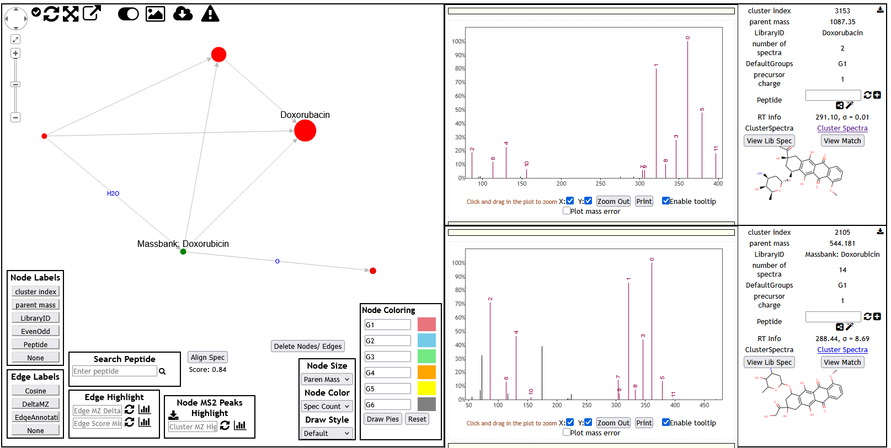
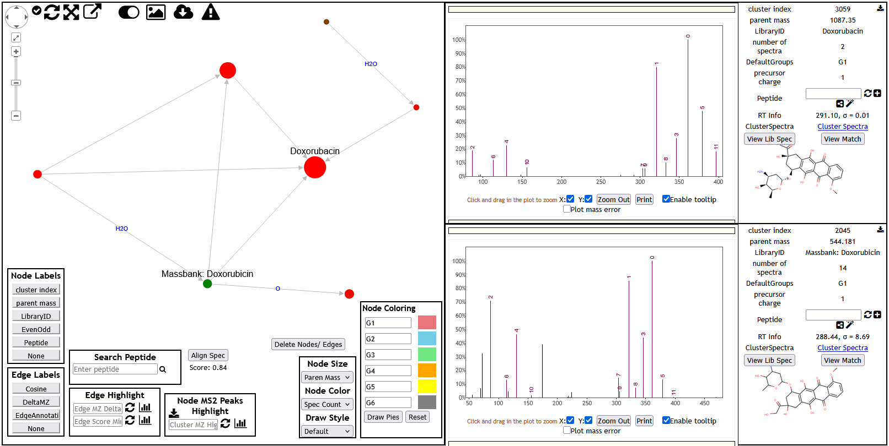

# Overview 

This report is built based on the tutorial of https://www.youtube.com/watch?v=s5y1XNKENbk.

**In this report, we have processed and analyzed the LC-MS/MS data set of MSV000088759, which includes three sub-files: **

*MSV000088759/peak/5ugmL_Opti_NCE_stepped20-30-40_1.mzML 
 MSV000088759/peak/5ugmL_Opti_NCE_stepped20-30-40_2.mzML 
 MSV000088759/peak/5ugmL_Opti_NCE_stepped20-30-40_3.mzML *

We explored the molecular networking of a special molecular cluster :**Doxorubacin** and use different Precursor Ion Mass Tolerance 
and Fragment Ion Mass Tolerance to discuss the how tolerance value affects results.

As shown in the https://github.com/MosesLee2020/Research_Method_Xingyu/blob/GNPS_(Molecular_Networking)/Job_Parameters%20in%20Case_1%20and%20Case_2.md#in-case_2-we-set-the-parameters-as-following 

The main difference between ***Case_1*** and ***Case_2*** is: *Precursor Ion Mass Tolerance* and *Fragment Ion Mass Tolerance*, 
Which in Case_1 is **0.01 Da** and **0.01 Da**, respectively 
and in Case_2 is **0.02 Da** and **0.02 Da**, respectively.

# Results and Discussion

The Job page of ***Case_1*** can be accessed by  https://gnps.ucsd.edu/ProteoSAFe/status.jsp?task=bc4e166768e74709b82c8123473a1ba8 

The Job page of ***Case_2*** can be accessed by  https://gnps.ucsd.edu/ProteoSAFe/status.jsp?task=7d4e4eee2c5e4250984429bfd41841cd 

***Doxorubacin cluster family
***

 **Network Viewer** are shown and configured:  
     - **Node Labels:** Cluster index  
     - **Node Size:** Parent Mass  
     - **Node Color:** Spectral Count  
     - **Edge Labels:** Δ m/z  
 in following Figures:

*Figure.1 GNPS molecular network of the Doxorubacin family (***Case_1***). Nodes marked by cluster index; edges labeled with Δm/z.
*
_________________________________________

*Figure.2 GNPS molecular network of the Doxorubacin family (***Case_2***). Nodes marked by cluster index; edges labeled with Δm/z.
*
_________________________________________
In addition, I have used the function of "EdgeAnnotation" to mark the "Putative Neutral Loss" and then calculaate the aligned spectrum, which is 0.84 in both ***Case_1*** and ****Case_2***.

**Network Viewer** are shown and configured:  
     - **Node Labels:** LibraryID  
     - **Node Size:** Parent Mass  
     - **Node Color:** Spectral Count  
     - **Edge Labels:** Edge Annotation
 in following Figures:

*Figure.3 GNPS molecular network of the Doxorubacin family (***Case_1***).Nodes marked by LibraryID; edges labeled with neutral‐loss annotations 
*
_________________________________________

*Figure.4 GNPS molecular network of the Doxorubacin family (***Case_2***).Nodes marked by LibraryID; edges labeled with neutral‐loss annotations 
*
